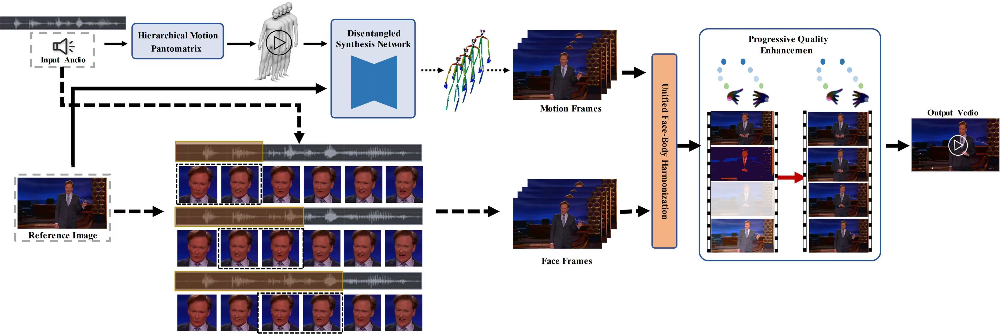

# HUMANMOTION++: Hierarchical Disentangled Framework for Photorealistic Full-Body Audio-Driven Animation

[](https://arxiv.org/abs/XXXX.XXXXX)
[](https://www.youtube.com/playlist?list=PL01yj5WpAbDMySOGsrJXPFFw-mA3U0Hx_)
[](https://github.com/ChaitanyaAhuja/PATS)

Official PyTorch implementation of **HUMANMOTION++**, a novel framework for generating high-fidelity, full-body audio-driven animations from a single reference image and audio input.



🎥 Generated Results
<div align="center"> <table> <tr> <td align="center"></td> <td align="center"></td> <td align="center"></td> </tr> <tr> <td align="center"></td> <td align="center"></td> </tr> </table> <p> <em>Diverse examples of full-body audio-driven animations generated by HumanMotion++ from different reference images and audio inputs.</em> </p> </div>

## ✨ Features

- **Hierarchical Motion Decomposition**: Maps speech to semantic gestures and refines with prosodic cues.
- **Disentangled Synthesis Network**: Separates motion and appearance for robust identity preservation.
- **Unified Face-Body Harmonization**: Seamlessly blends facial and body animations.
- **Progressive Quality Enhancement**: Specialized modules for hand and facial detail refinement.
- **State-of-the-Art Performance**: Superior video coherence, hand accuracy, and identity preservation.

## 📖 Paper Abstract

> Photorealistic, audio-driven digital humans remain largely limited to talking heads and struggle with coherent full-body motion. We present HumanMotion++, a framework that generates high-fidelity, temporally stable full-body animation from a single reference image and audio. Our approach combines hierarchical motion decomposition, disentangled synthesis, and unified harmonization to produce natural and expressive digital humans.

[Read the full paper](https://arxiv.org/abs/XXXX.XXXXX)

## 🚀 Installation

```bash
git clone https://github.com/xlf0617/HumanMotionPlusPlus.git
cd HumanMotionPlusPlus
pip install -r requirements.txt
```

## 🧠 Model Architecture

The framework consists of four main modules:

1. **Hierarchical Motion Decomposition (HMD)**
   - Semantic Motion Prior (SMP)
   - Prosodic Motion Refinement (PMR)

2. **Disentangled Synthesis Network (DSN)**
   - Motion Branch
   - Appearance Branch
   - Cross-Attention Fusion

3. **Unified Face-Body Harmonization (UFBH)**
   - Spatial-Temporal Consistency Loss
   - Boundary Smoothing Network

4. **Progressive Quality Enhancement (PQE)**
   - HandRefiner
   - Facial Landmark Stabilization

## 📊 Results

| Method       | FID ↓ | FVD ↓ | HKC ↑ | CSIM ↑ |
|--------------|-------|-------|-------|--------|
| EchoMimicV2  | 33.42 | 277.71| 0.425 | 0.519  |
| Sonic        | 24.11 | 211.71| 0.271 | 0.517  |
| **Ours**     | **26.37** | **207.65** | **0.431** | **0.614** |

## 🎥 Demo

Check out our video demos on [YouTube](https://www.youtube.com/playlist?list=PL01yj5WpAbDMySOGsrJXPFFw-mA3U0Hx_).

## 🛠️ Usage

### Inference

```python
from humanmotionpp import HumanMotionPP

model = HumanMotionPP.from_pretrained("humanmotionpp-base")
result = model.generate(
    image_path="path/to/reference/image.jpg",
    audio_path="path/to/audio.wav"
)
result.save("output_video.mp4")
```

### Training

```bash
python train.py --config configs/base.yaml --data_dir /path/to/dataset
```

## 📦 Dataset

We use the [PATS dataset](https://github.com/ChaitanyaAhuja/PATS) for training and evaluation. Please follow the official instructions to download and preprocess the data.

## 📝 Citation

If you use this code or find our work helpful, please cite:

```bibtex
@inproceedings{xie2025humanmotion++,
  title={HUMANMOTION++: A Hierarchical Disentangled Framework for Photorealistic Full-Body Audio-Driven Animation},
  author={Xie, Longfei and Fan, Qinyuan and Wang, Suli and Wang, Junqiao and Zhang, Heng and Ma, Xinyu and Yu, Mingrui and Wang, Yuze and Shi, Tianyu},
  booktitle={ICASSP},
  year={2025}
}
```

## 👥 Contributors

- Longfei Xie (South China Normal University)
- Qinyuan Fan (TU Berlin)
- Suli Wang (TU Darmstadt)
- Junqiao Wang (Shanghai AI Lab)
- Heng Zhang, Xinyu Ma (Vector Function Tech)
- Mingrui Yu (University of Calgary)
- Yuze Wang (Vector Function Tech)
- Tianyu Shi (University of Toronto) - Corresponding Author

## 📄 License

This project is licensed under the MIT License. See [LICENSE](LICENSE) for details.

## 🤝 Acknowledgements

We thank the authors of [BEAT](https://github.com/PantoMatrix/BEAT) and [MimicMotion](https://github.com/MimicMotion) for their open-source contributions.
